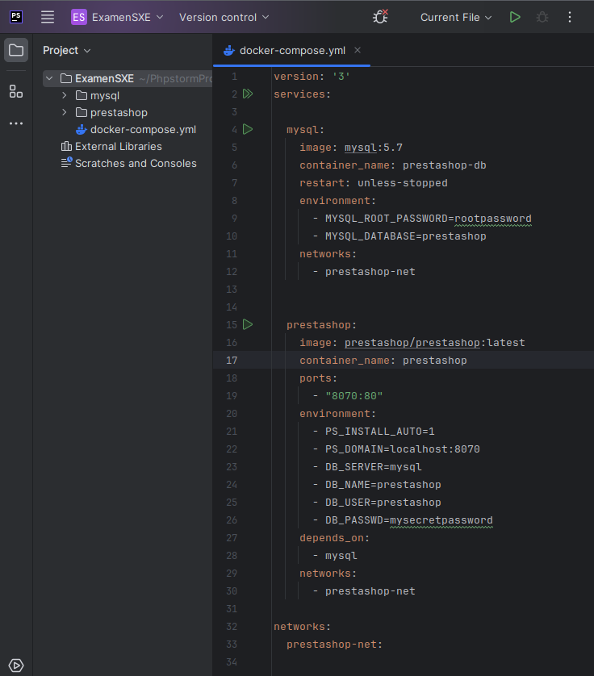

# Examen SXE - Docker

A continuación, explicaré los pasos para poner en marcha PrestaShop utilizando Docker. Utilizaré Docker Compose y vincularé una base de datos MySQL.

<br/><br/>

# Explicación
<details>
<summary>Cómo poner en marcha PrestaShop con Docker Compose.</summary>

## 1. Archivo docker-compose.yml

Creo un archivo `docker-compose.yml` con los siguientes parámetros:

```php
version: '3'
services:

  mysql:
    image: mysql:5.7
    container_name: prestashop-db
    restart: unless-stopped
    environment:
      - MYSQL_ROOT_PASSWORD=rootpassword
      - MYSQL_DATABASE=prestashop
    networks:
      - prestashop-net


  prestashop:
    image: prestashop/prestashop:latest
    container_name: prestashop
    ports:
      - "8070:80"
    environment:
      - PS_INSTALL_AUTO=1
      - PS_DOMAIN=localhost:8070
      - DB_SERVER=mysql
      - DB_NAME=prestashop
      - DB_USER=prestashop
      - DB_PASSWD=mysecretpassword
    depends_on:
      - mysql
    networks:
      - prestashop-net

networks:
  prestashop-net:
```

En este archivo se definen dos servicios: `prestashop` y `db`. El primero utiliza la imagen oficial de PrestaShop, expone el puerto 8070 y establece variables de entorno para configurar la base de datos, utilizando volúmenes para persistir los datos en la carpeta `./prestashop`. El servicio `db` utiliza la imagen de MySQL, configura las credenciales y utiliza volúmenes para persistir la base de datos en la carpeta `./mysql`.

## 2. Iniciar los contenedores

En la terminal, situados en el directorio donde se encuentra `docker-compose.yml`, ejecutamos el comando `docker-compose up -d`, lo cual iniciará los contenedores en segundo plano y haciendo que sea posible acceder a la tienda desde el navegador.

## 3. Configurar PHPStorm para la base de datos

- **1.** Nos dirigimos a la pestaña de bases de datos en PHPStorm y hacemos click en el signo **"+"**, seleccionando _"Data Source"_ de entre las posibles opciones.

- **2.** Seleccionamos **MySQL** como tipo de base de datos.

- **3.** Rellenamos los campos con los siguientes detalles:

        - Host: `localhost`(porque el contenedor MySQL está enlazado al host)
        - Port: `3306`
        - User: `prestashop`
        - Password: `mysecretpassword`
        - Database: `prestashop`

- **5.** Comprobamos con _"Test Connection"_ que la conexión sea exitosa y luego hacemos click en **"OK"** para guardar la configuración.
</details>

<br/><br/>

# Capturas de pantalla
<details>
<summary>Imágenes relacionadas con el proyecto.</summary>

### - Archivo .yml en el proyecto de PHPStorm


### - Carpeta en la que está todo lo necesario tras iniciar los contenedores.


### - Selección de MySQL


### - Configuración la base de datos en PHPStorm


### - Varias imágenes de la tienda en funcionamiento


</details>

